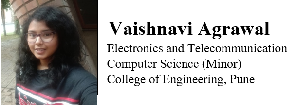
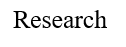
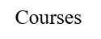

### <ins>__Courses__</ins>

* __Machine Learning__ by Stanford University on Coursera
    
    Instructor: Andrew ng
    
* __Deep Learning__ NPTEL course by IIT Kharagpur
    
    Instructor: Prof. Prabir Kumar Biswas
    
* __Python Programming__ by University of Michigan on Coursera
    
    Instructor: Charles Russell Severance
    
    
    

### __Contact__
    
Personal Email ID: [agrawalvaishnavi01@gmail.com]
    
College Email ID: [agrawalvj17.extc@coep.ac.in]
